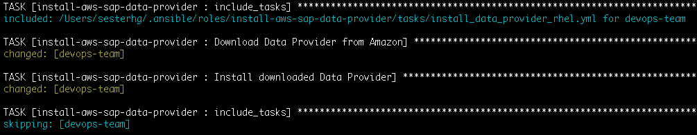

# Install AWS SAP Data Provider Ansible role

```
Copyright Amazon.com, Inc. or its affiliates. All Rights Reserved.
SPDX-License-Identifier: MIT-0
```

This is an Ansible role containing the "Install AWS SAP Data Provider" shared role that other playbooks use to install components of the SAP ecosystem

Its purpose is to install the AWS SAP Data Provider on OS to prepare for a SAP Installation

# Roles' tasks:

1. Install Data Provider

## How to use

On your main <code>.yml</code> file add:

```
- name: Install AWS SAP Data Provider
  become: yes
  hosts: all
  roles:
    - role: install-aws-sap-data-provider
```

## Sample output

During run time on your Ansible output you should see an entry like the one below:



## OS Compatibility

* RedHat
* Suse