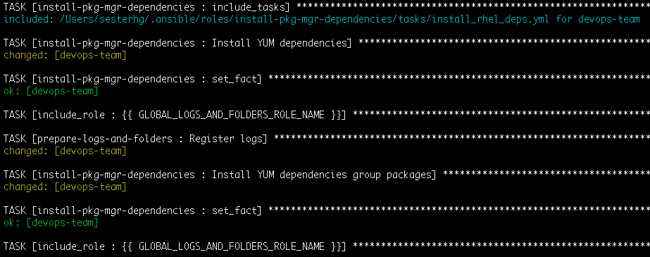

# Install Package Manager related Dependencies Ansible role

```
Copyright Amazon.com, Inc. or its affiliates. All Rights Reserved.
SPDX-License-Identifier: MIT-0
```

This is an Ansible role containing the "Install Package Manager Dependencies" shared role that other playbooks use to install components of the SAP ecosystem

Its purpose is to install all dependencies that are related to package managers such as <code>YUM, ZYPPER, APT, etc</code> on OS to prepare for a SAP Installation

# Role's tasks:

1. Install package manager dependencies. You can find all the packages that are gonna be installed on the file defaults/main.yml on variables according to your operating system

## How to use

On your main <code>.yml</code> file add:

```
- name: Install Package Manager Dependencies
  become: yes
  hosts: all
  roles:
    - role: install-pkg-mgr-dependencies
```

## Dependencies

* <b>Prepare Logs Folders</b> to register its installation logs. So make sure you have both this and "Prepare Logs Folders" on your requirements file for your full playbook.

## Sample output

During run time on your Ansible output you should see an entry like the one below:



## OS Compatibility

* RedHat
* Suse