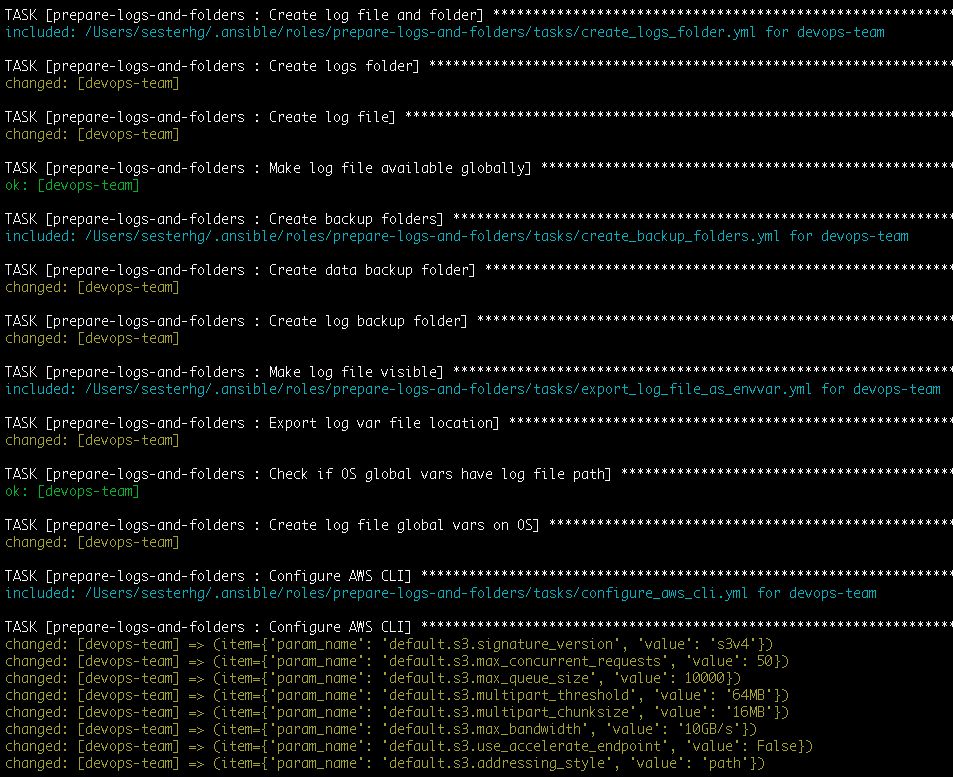

# Prepare Logs and Log Folders Ansible role

```
Copyright Amazon.com, Inc. or its affiliates. All Rights Reserved.
SPDX-License-Identifier: MIT-0
```

This is an Ansible role containing the "Prepare Logs and Log Folders" shared role that other playbooks use to install components of the SAP ecosystem

Its purpose is to prepare everything on the hosting OS related to the logs of SAP installation before running it

# Role's tasks:

1. Configure AWS CLI
2. Create backup folders
3. Create logs folders
4. Register group logs
5. Register single logs

## How to use

On your main <code>.yml</code> file add:

```
- name: Prepare Logs and Log Folders
  become: yes
  hosts: all
  roles:
    - role: prepare-logs-folders
```

## Sample output

During run time on your Ansible output you should see an entry like the one below:



## OS Compatibility

* RedHat
* Suse