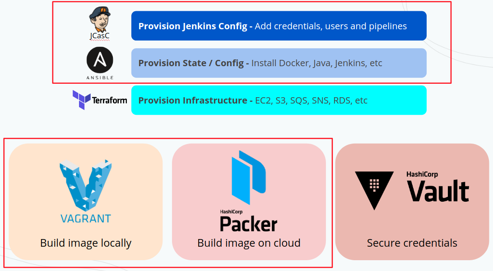

## 2. Customizing this repo: configuring Jenkins and creating your pipelines

```
Copyright Amazon.com, Inc. or its affiliates. All Rights Reserved.
SPDX-License-Identifier: MIT-0
```

This project has configurations for Jenkins with Terraform, Ansible, SSM, AWS CLI, Java, and HAProxy (for TLS activation). You can change all this configuration on file <code>ansible_config/site.yml</code>. More information on roles on the last part of this readme.

### Jenkins configuration files

1. This jenkins is configured automatically using Jenkins plugin <code><a href="https://www.jenkins.io/projects/jcasc/">configuration as code</a></code>. All the configuration is listed on file <code>jenkins.yaml</code> available in <code>ansible_config/roles/ansible-role-jenkins/files/jenkins.yaml</code>. On that file you can add your pipelines and credentials for those pipelines to consume. Full documentation and possibilities <a href="https://www.jenkins.io/projects/jcasc/" target="_blank">can be found here</a>.
2. To set your own pipelines as code, check the file <code>ansible_config/roles/ansible-role-jenkins/files/jenkins.yaml</code>. There you're going to find same examples about credentials mapping and one example pipeline. For more documentation on how to write pipelines as code, please refer to <a href="https://localhost:5555/plugin/job-dsl/api-viewer/index.html" target="_blank">https://localhost:5555/plugin/job-dsl/api-viewer/index.html</a>
3. The plugins that this Jenkins will have installed can be found at: <code>ansible_config/roles/ansible-role-jenkins/defaults/main.yml</code>. If you need to get your current installed plugins, you can find how to <a href="https://stackoverflow.com/questions/9815273/how-to-get-a-list-of-installed-jenkins-plugins-with-name-and-version-pair" target="_blank">here</a>.
4. You can change jenkins default admin password on file <code>ansible_config/roles/ansible-role-jenkins/defaults/main.yml</code> attribute "jenkins_admin_password"

### 2.1. Using Packer to build your AMI

Packer is a tool to create an OS image

Running packer (pending):
1. <code>packer build -var AWS_USER_CREDS_HERE packer_config.json</code>
2. Once you have your AMI created, go for your cloud console and create a new machine pointing to the newly created image.

Checkout the file <code>packer_config.json</code> to see how packer will create your SO image and AWS instructions for it

PS: This specific packer_config.json file is configured to create an image on AWS. You can change it to run on AWS if you have to.

IMPORTANT for SECURITY: If you are building for production environment go to file <code>ansible_config/roles/ansible-role-jenkins/defaults/main.yaml</code> and uncomment lines <code>- option: "JENKINS_ARGS"</code> and <code>value: "--httpListenAddress=127.0.0.1"</code>

Once done, your Jenkins will stop answering for all requests that don't come through HAProxy, and therefore will only accept https requests and deny all the others. If you still have to allow this access, after everything is set up, ssh into the created machine and change the "127.0.0.1" in the very end of file /etc/default/jenkins to "0.0.0.0" and restart jenkins service.

## 2.2. Understanding Ansible

Ansible is a tool to configure our OS as we want it to be.

You can run ansible with: <code>ansible playbook site.yml</code>. See examples at <code>Vagrantfile</code> and <code>packer_config.json</code>

The main file for this folder is <code>ansible_config/site.yml</code>. This file calls all the roles in "roles" folder

### Ansible roles:

The roles folder has the Ansible configuration for:
1. Add Java PPA
2. Role - Install Java JDK 8
3. Role - Install Terraform
4. Role - Install Ansible
5. Role - AWS CLI
6. Role - Commons
7. Role - Install Jenkins (with plugins and pipelines configuration)
8. Role - Install HAProxy to handle the server TLS

## 2.3. Activating TLS (https)

### 2.3.1 - TLS: Once you have your machine up and running, connect through SSH

1. Check if the AMI image you built to install Jenkins has the option to activate TLS set while running the playbook (variable <code>activate_tls_only</code> on ansible-role-haproxy).
2. Change the configurations on file <code>ansible_config/roles/ansible-role-haproxy/templates/haproxy-tls.cfg</code> to point to your company's URL instead of "jenkins.mycompany.com"
3. Having your company certificates handy, generate the .pem certificate file with command <code>cat STAR.mycompany.com.crt STAR.mycompany.com.key > fullkey.pem</code>. Remember to remove the empty row that is kept inside the generated fullkey.pem between the two certificates. To look at the file use <code>cat fullkey.pem</code>
4. Move the generated file to your running instance's folder <code>/home/centos/jenkins/</code>
5. Restart HAProxy with <code>sudo service haproxy restart</code>

IMPORTANT: If you changed the file /etc/default/jenkins to IP 0.0.0.0, put it back to 127.0.0.1 otherwise Jenkins will still accept connections from non-https requests

Done! Your Jenkins is ready to run under https with valid certificates. Just point your DNS to the running machine and you're done.

## 2.4. More about this project

This project covers the following tools:

